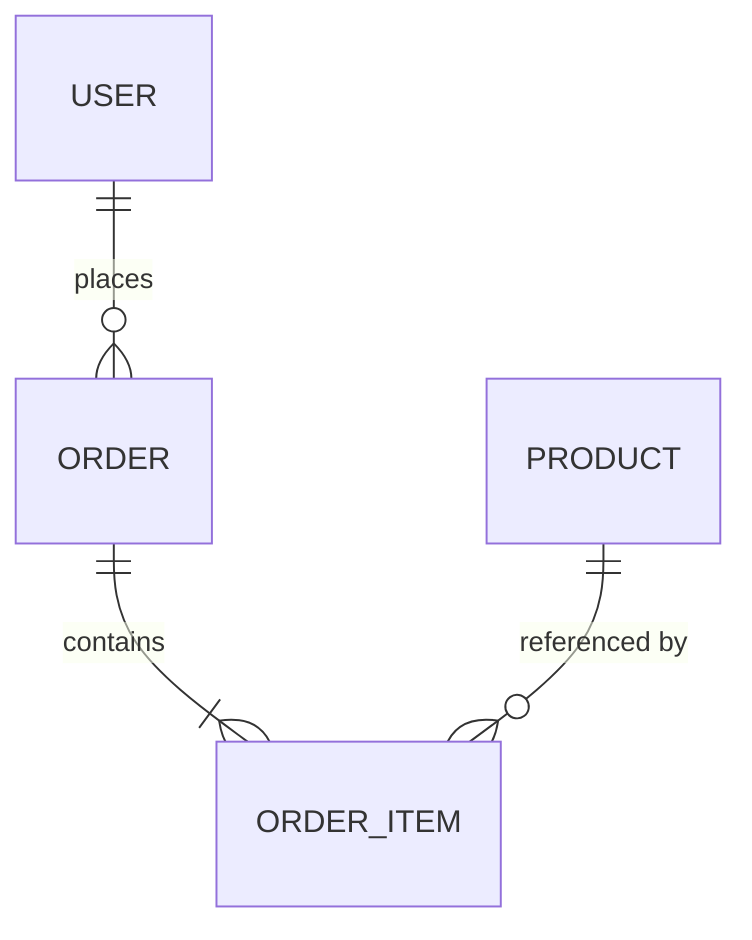

# 产品设计：从模糊想法到可实现的模块化需求

将一个完整的产品/系统想法，**按模块拆分**为一组可独立交付的需求文档，并同步输出**数据库表结构设计**。每个模块独立一份 PRD，需求点细致到"前端工程师看完就能写页面、后端工程师看完就能写接口"。

## 核心原则

1. **先拆模块，再写需求** — 永远不要把一个大产品写在一份文档里
2. **一个模块 = 一份文档** — 每个模块独立的 PRD，单文件完整可读
3. **需求点要"可执行"** — 每条需求必须有主语（谁）、动作（做什么）、约束（规则）、结果（反馈）
4. **表结构与需求同步产出** — 需求里出现的每个实体，都必须在表结构中有对应表
5. **显式声明"不做"** — 明确列出本期不做的需求（YAGNI），避免范围蔓延

<HARD-GATE>
在用户确认"模块拆分方案"之前，不要开始写任何模块的详细 PRD。
先让用户 review 拆分是否合理，再逐个模块深入。
</HARD-GATE>

## 工作流程

```
1. 理解产品 → 2. 拆分模块 → 3. 用户确认拆分 → 4. 逐模块输出 PRD + 表结构 → 5. 全局整合（ER 图、术语表）
```

### 阶段 1：理解产品（问题先行）

**每次只问一个问题**，优先选择题。关键要搞清楚：

- **产品定位**：给谁用？解决什么核心问题？
- **核心场景**：用户的典型使用路径是什么？（描述一条 happy path）
- **角色划分**：系统里有几种角色？（如 C 端用户 / B 端商家 / 管理员）
- **范围边界**：MVP 要包含什么？明确不做什么？
- **技术约束**：Web / App / 小程序？是否有已定技术栈？

> ⚠️ 如果用户一上来就说"帮我设计一个电商系统"，不要立刻开始拆。先反问 2-3 个关键问题锁定范围，避免做成"大而全"的通用方案。

### 阶段 2：拆分模块（MECE 原则）

按照 **"相互独立、完全穷尽"（MECE）** 原则拆分，常见拆分维度：

| 拆分维度 | 适用场景 | 示例 |
|---------|---------|------|
| 按**用户角色** | 多角色系统 | 用户端 / 商家端 / 管理后台 |
| 按**业务领域** | 业务复杂系统 | 账户 / 订单 / 支付 / 库存 / 营销 |
| 按**使用频率** | C 端产品 | 核心流程 / 辅助功能 / 设置中心 |
| 按**数据实体** | 内容型系统 | 用户管理 / 内容管理 / 评论互动 |

**输出：模块拆分方案（表格 + 依赖关系）**

```markdown
## 模块拆分方案

| 编号 | 模块名 | 核心职责 | 优先级 | 依赖模块 |
|------|--------|---------|--------|---------|
| M1 | 账户模块 | 注册/登录/个人信息管理 | P0 | - |
| M2 | 商品模块 | 商品发布/展示/搜索 | P0 | M1 |
| M3 | 订单模块 | 下单/订单状态流转 | P0 | M1, M2 |
| M4 | 支付模块 | 支付/退款 | P0 | M3 |
| M5 | 评价模块 | 评价/晒单 | P1 | M3 |
| M6 | 管理后台 | 商品/订单/用户管理 | P1 | M1~M5 |

## 模块依赖图

（用 mermaid 或简单箭头表示依赖关系）
```

**此处必须停下，等用户确认拆分方案。**

### 阶段 3：逐模块输出 PRD + 表结构

每个模块独立一个文件，输出到用户指定目录（默认 `./docs/prd/`）：

```
docs/prd/
├── 00-overview.md           # 产品总览（拆分方案 + 全局术语 + ER 图）
├── 01-account.md            # M1 账户模块 PRD
├── 02-product.md            # M2 商品模块 PRD
├── 03-order.md              # M3 订单模块 PRD
├── ...
└── schema/
    └── database-schema.sql  # 完整 DDL（所有模块的表）
```

## 单个模块 PRD 模板

**每个模块的 PRD 必须包含以下 8 个章节，不能省略：**

```markdown
# Mx - 模块名

## 1. 模块概述
- **模块职责**：一句话说清这个模块负责什么
- **核心价值**：为用户解决什么问题
- **涉及角色**：C 端用户 / 商家 / 管理员
- **依赖模块**：依赖哪些前置模块
- **被依赖**：被哪些模块依赖

## 2. 名词解释
对本模块特有的业务术语做定义（避免跨模块歧义）。

| 术语 | 定义 |
|------|------|
| SKU | Stock Keeping Unit，最小库存单位，同一商品不同规格 |

## 3. 用户故事（User Story）
按角色列出使用场景，格式：**作为 <角色>，我希望 <做什么>，以便 <达到什么目的>**

- US-01：作为普通用户，我希望用手机号注册账号，以便快速开始使用
- US-02：作为已注册用户，我希望通过短信验证码登录，以便无需记住密码

## 4. 功能需求清单
**这是 PRD 的核心。每条需求都必须足够细，让工程师不用追问。**

按功能分组，每组用表格列出：

### 4.1 注册功能

| 需求编号 | 需求描述 | 输入/交互 | 校验规则 | 成功反馈 | 失败反馈 |
|---------|---------|-----------|---------|---------|---------|
| FR-1.1 | 用户使用手机号+短信验证码注册 | 手机号输入框、获取验证码按钮、验证码输入框 | 手机号：11 位数字，中国大陆号段；验证码：6 位数字，5 分钟有效 | 跳转首页并自动登录 | 手机号格式错误 / 验证码错误 / 验证码过期 / 手机号已注册 |
| FR-1.2 | 验证码获取限频 | 点击"获取验证码"按钮 | 同一手机号 60s 内只能发送 1 次，每天最多 10 次 | 按钮进入 60s 倒计时禁用状态 | 超过日限提示"今日验证码发送次数已达上限" |

### 4.2 登录功能
...

## 5. 页面与交互
列出本模块涉及的所有页面，以及页面内的交互逻辑。

| 页面编号 | 页面名 | 入口 | 主要元素 | 关键交互 |
|---------|--------|------|---------|---------|
| P-01 | 注册页 | 登录页 → "立即注册" | 手机号、验证码、密码、同意协议复选框、注册按钮 | 未勾选协议时，注册按钮置灰 |

## 6. 业务流程（状态流转）
对涉及状态机的业务，画出状态流转图和条件。

```
[待支付] --用户支付成功--> [待发货]
[待支付] --超时 30 分钟--> [已取消]
[待支付] --用户主动取消--> [已取消]
[待发货] --商家发货--> [已发货]
[已发货] --用户确认收货 / 自动确认（发货后 7 天）--> [已完成]
```

状态表：

| 状态 | 说明 | 允许操作 | 可流转到 |
|------|------|---------|---------|
| 待支付 | 订单已创建未支付 | 支付、取消 | 待发货、已取消 |
| 待发货 | 已支付等待发货 | 申请退款 | 已发货、退款中 |

## 7. 数据库表结构
**与需求同步设计，本模块涉及的所有表都列在这里。**

### 7.1 表清单

| 表名 | 说明 | 主要字段 |
|------|------|---------|
| user | 用户主表 | id, phone, password_hash, nickname, ... |
| user_profile | 用户扩展信息 | user_id, avatar, gender, birthday, ... |

### 7.2 表详细设计

#### user（用户表）

| 字段 | 类型 | 约束 | 默认值 | 说明 |
|------|------|------|--------|------|
| id | BIGINT UNSIGNED | PK, AUTO_INCREMENT | - | 主键 |
| phone | VARCHAR(20) | UNIQUE, NOT NULL | - | 手机号，登录账号 |
| password_hash | VARCHAR(128) | NOT NULL | - | 密码 bcrypt hash |
| nickname | VARCHAR(64) | NOT NULL | - | 昵称 |
| status | TINYINT | NOT NULL | 1 | 0=禁用 1=正常 2=注销 |
| created_at | DATETIME | NOT NULL | CURRENT_TIMESTAMP | 创建时间 |
| updated_at | DATETIME | NOT NULL | CURRENT_TIMESTAMP ON UPDATE | 更新时间 |

**索引：**
- PRIMARY KEY (id)
- UNIQUE KEY uk_phone (phone)
- KEY idx_created_at (created_at)

**DDL：**
```sql
CREATE TABLE `user` (
  `id` BIGINT UNSIGNED NOT NULL AUTO_INCREMENT COMMENT '主键',
  `phone` VARCHAR(20) NOT NULL COMMENT '手机号',
  `password_hash` VARCHAR(128) NOT NULL COMMENT '密码hash',
  `nickname` VARCHAR(64) NOT NULL COMMENT '昵称',
  `status` TINYINT NOT NULL DEFAULT 1 COMMENT '0=禁用 1=正常 2=注销',
  `created_at` DATETIME NOT NULL DEFAULT CURRENT_TIMESTAMP,
  `updated_at` DATETIME NOT NULL DEFAULT CURRENT_TIMESTAMP ON UPDATE CURRENT_TIMESTAMP,
  PRIMARY KEY (`id`),
  UNIQUE KEY `uk_phone` (`phone`),
  KEY `idx_created_at` (`created_at`)
) ENGINE=InnoDB DEFAULT CHARSET=utf8mb4 COMMENT='用户表';
```

## 8. 非功能需求 & 边界说明

- **性能**：登录接口 P99 < 300ms，验证码发送异步化
- **安全**：密码使用 bcrypt（cost=10）；登录失败 5 次锁定 30 分钟
- **本期不做**（明确列出）：
  - ❌ 第三方登录（微信、Apple）
  - ❌ 账号找回（本期走人工客服）
  - ❌ 多设备登录管理
```

## 数据库设计规范

### 通用字段（所有表必须有）

| 字段 | 类型 | 说明 |
|------|------|------|
| id | BIGINT UNSIGNED | 主键，自增 |
| created_at | DATETIME | 创建时间 |
| updated_at | DATETIME | 更新时间 |
| deleted_at | DATETIME | 软删除时间（如需软删除） |

### 命名规范

- **表名**：小写下划线，单数形式（`user` 而非 `users`）
- **字段名**：小写下划线（`created_at` 而非 `createdAt`）
- **外键字段**：`{被关联表}_id`（如 `user_id`）
- **索引命名**：
  - 主键：`PRIMARY KEY`
  - 唯一索引：`uk_{字段名}`
  - 普通索引：`idx_{字段名}`
  - 联合索引：`idx_{字段1}_{字段2}`

### 字段设计红线

- ❌ 不允许使用 `ENUM` 类型（扩展困难），用 `TINYINT` + 注释说明枚举值
- ❌ 不允许 `FLOAT` / `DOUBLE` 存金额，一律 `DECIMAL(m,n)` 或 `BIGINT`（以分为单位）
- ✅ 所有 `VARCHAR` 必须指定合理长度，避免 `VARCHAR(255)` 一刀切
- ✅ 状态字段必须在注释中列出所有可能值及含义
- ✅ 时间字段统一用 `DATETIME`，不用 `TIMESTAMP`（避免 2038 问题）

### 关联关系处理

| 关系 | 实现方式 |
|------|---------|
| 一对一 | 外键 + 唯一索引 |
| 一对多 | 在"多"方加外键 |
| 多对多 | 中间表，含两个外键 + 联合唯一索引 |

## 00-overview.md 模板（产品总览）

所有模块完成后，产出一份总览文档：

```markdown
# 产品总览

## 1. 产品定位
一句话产品定位 + 目标用户 + 核心价值。

## 2. 模块拆分
（从阶段 2 的拆分方案复制过来）

## 3. 全局 ER 图
用 mermaid 画出跨模块实体关系。



## 4. 全局术语表
跨模块共用的核心术语。

## 5. 角色权限矩阵
| 功能 | C端用户 | 商家 | 管理员 |
|------|--------|------|--------|
| 浏览商品 | ✅ | ✅ | ✅ |
| 发布商品 | ❌ | ✅ | ✅ |

## 6. 本期范围（MVP）
明确列出本期包含的模块和不包含的功能。
```

## 快速参考：需求点"足够细"的判定标准

一条需求点是否够细，用这 **7 问自检**：

| 检查项 | 示例（够细） | 示例（不够细） |
|--------|-------------|---------------|
| 1. 谁来做？ | 未登录用户 | 用户 |
| 2. 在哪做？ | 登录页手机号输入框 | 登录时 |
| 3. 输入是什么？ | 11 位手机号 + 6 位验证码 | 账号密码 |
| 4. 校验规则？ | 手机号正则 `^1[3-9]\d{9}$` | 手机号格式正确 |
| 5. 成功反馈？ | 跳转 /home 并显示欢迎 toast | 登录成功 |
| 6. 失败反馈？ | 验证码错误→输入框下方红色文字"验证码不正确" | 提示错误 |
| 7. 边界/异常？ | 连续输错 5 次锁定账号 30 分钟 | - |

**如果 7 问有任何一项答不出来，说明需求还不够细。**

## 常见错误

### 错误 1：一份文档写完所有模块
**症状**：一个 `prd.md` 文件有 2000+ 行，什么都有。
**后果**：开发只看自己模块时，被无关内容干扰；维护时牵一发动全身。
**修正**：严格按模块拆文件，一个模块一份。

### 错误 2：需求点停留在"是什么"，不说"怎么做"
**症状**："用户可以登录"，没有说校验、反馈、边界。
**修正**：用上面 7 问自检表逐条过一遍。

### 错误 3：表结构留到最后才设计
**症状**：PRD 写完才发现实体关系冲突，需求推倒重来。
**修正**：写每个模块 PRD 时同步设计表结构，发现冲突立即回头修正需求。

### 错误 4：状态流转靠想象，没有状态机
**症状**：订单状态流转在需求里只说了正向流程，退款/超时场景没考虑。
**修正**：每个有状态的实体都必须画状态机图，列出所有流转条件。

### 错误 5：没有"不做什么"
**症状**：需求只列做什么，结果开发问"这个要做吗？"
**修正**：每个模块的第 8 节必须列出本期不做的功能。

### 错误 6：模块之间耦合不清
**症状**：订单模块的 PRD 里大段描述商品信息展示。
**修正**：跨模块只引用对方的接口/实体 ID，不复制对方模块的需求。

## 红线 - 停下来重新开始

- 没问清楚范围就开始拆模块
- 没经用户确认拆分方案就开始写详细 PRD
- 把多个模块塞进同一份文档
- 写完需求才开始设计表结构
- 需求描述里出现"等等"、"类似"、"大概"这种模糊词
- 没有明确"本期不做"的列表

**以上任一项出现 = 停下来，回到对应阶段重做。**

## 输出清单（完成交付前自检）

- [ ] `00-overview.md` 存在，包含产品定位、模块拆分、ER 图、角色权限矩阵
- [ ] 每个模块有独立的 PRD 文件，命名规范（`01-xxx.md`、`02-xxx.md`）
- [ ] 每个模块 PRD 包含完整的 8 个章节
- [ ] 每条功能需求都有：编号、描述、输入、校验、成功反馈、失败反馈
- [ ] 所有涉及状态的实体都有状态机图 + 状态表
- [ ] 每个模块的表结构都有字段级说明 + 索引设计 + 完整 DDL
- [ ] 有完整的 `database-schema.sql` 文件（所有表的 DDL 合集，按依赖顺序）
- [ ] 每个模块都明确列出了"本期不做"清单
- [ ] 命名规范统一（表名、字段名、需求编号）
- [ ] 跨模块引用清晰（只引用 ID / 接口，不复制需求）
