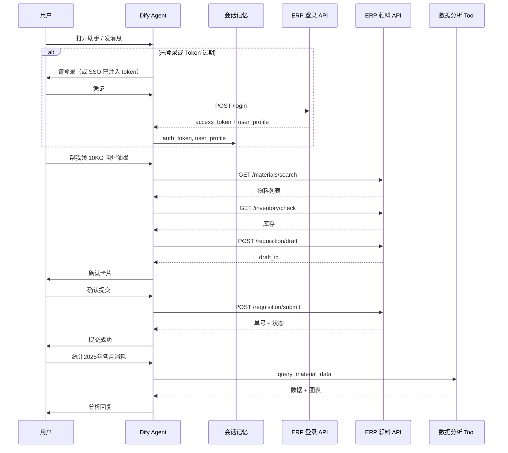

# 总体架构方案

## 1. 背景

锦顺现有 Dify 应用 **客户数据分析助手-正式库** 已实现：

- 自然语言 → Text2SQL → SQL Server 执行
- 数据分析播报 + ECharts 图表 + Excel 导出
- 会话内「查询 / 追问」路由与历史数据充分性判定

客户新增需求（见 `锦顺帐号.md`）：

1. **领料申请**：可直接提交工单到审批
2. **物料查询**：用量、部门用料、出入库（已有，需与领料共存）

ERP 方将提供 **登录 API** 与 **领料申请 API**。本方案在 Dify 侧做 **复合 ReAct 智能体** 编排，ERP 侧负责身份、权限、写库与审批。

---

## 2. 总体架构（混合编排 · 推荐终态）

> 详设：[13-混合编排架构-推荐终态.md](13-混合编排架构-推荐终态.md)

```
┌─────────────────────────────────────────────────────────────┐
│                        用户（Web / 嵌入页）                    │
└─────────────────────────────┬───────────────────────────────┘
                              │
┌─────────────────────────────▼───────────────────────────────┐
│         Dify App：锦顺物料综合助手（Chatflow + 混合编排）        │
│  ┌─────────────────────────────────────────────────────┐   │
│  │ L0 Router：意图分类（查数/追问/领料/混合/寒暄）            │   │
│  └────────────┬───────────────────────────┬────────────┘   │
│               │ Fast 路径                  │ Agent 路径       │
│  ┌────────────▼──────────┐   ┌───────────▼──────────────┐   │
│  │ invoke_chatflow 网关   │   │ ReAct Agent + 多 Tool     │   │
│  │ → summary/detail/id   │   │ erp_* + 网关（混合时）      │   │
│  └────────────┬──────────┘   └───────────┬──────────────┘   │
│  ┌────────────▼──────────────────────────▼──────────────┐   │
│  │ L2 Presenter：Answer 绑会话变量（detail 不经过 LLM 重生成） │   │
│  └────────────┬──────────────────────────┬────────────┘   │
│  ┌────────────▼──────────┐   ┌───────────▼──────────────┐   │
│  │ 锦顺-数据分析子流程     │   │ ERP 后端 API              │   │
│  │ Text2SQL + 分析 + 导出  │   │ 登录 + 领料 + 审批         │   │
│  └────────────┬──────────┘   └──────────────────────────┘   │
│               ▼                                              │
│         SQL Server（只读）                                     │
│  记忆层：conversation_id / last_query_* / auth / draft       │
└───────────────────────────────────────────────────────────────┘
```

**核心原则**：

1. **重计算在 Tool / 子流程**（Text2SQL、领域分析、导出）— 不挪到主 Agent  
2. **纯查数走 Fast 路径** — 性能 ≈ Tool 本身（~18s）  
3. **领料 / 混合走 Agent** — 保留 ReAct 多步编排与扩展性  
4. **助手感** — `summary` 导语 + `detail` 专业呈现，Answer 直连变量

---

## 3. 能力边界

| 能力域 | 实现方式 | 数据来源 |
|--------|----------|----------|
| 统计分析、排名、占比、趋势 | `query_material_data` Tool | SQL Server 只读（Text2SQL） |
| 图表、Excel 导出 | 子工作流内现有节点 | 查询结果 |
| 物料检索、库存校验 | `erp_search_material` / `erp_check_inventory` | ERP API（推荐）或只读 SQL |
| 领料草稿、提交审批 | `erp_save_draft` / `erp_submit_requisition` | ERP API（写） |
| 申请单状态查询 | `erp_get_requisition` | ERP API |
| 用户身份 | `erp_login` + 会话 `auth_token` | ERP 登录 API |

**原则**：Dify 负责对话与编排；ERP 负责鉴权、业务规则、事务与审批流。

---

## 4. 与现有 YAML 的关系

现有 `客户数据分析助手-正式库.yml` 核心链路：

```
Start
  → 问题分类器（查询 / 追问）
  → [追问] 历史数据充分性判定 → 问题合并 / 复用
  → 生成 SQL → 提取 SQL → rookie_excute_sql
  → 数据处理 → 数据分析 LLM → [可选] ECharts / XLSX
```

改造后（**Dify 1.13**）：

- 上述链路 **整体封装** 为子 **Chatflow** `锦顺-数据分析子流程.yml`（现网 `advanced-chat` 同类）
- **Publish as Tool** 后挂到主 Chatflow 的 **Agent 节点**
- 主应用为 **Chatflow + Agent 节点**（详见 [07-Dify-1.13-技术对齐说明.md](07-Dify-1.13-技术对齐说明.md)）
- 子工作流 **内部保留** 查询/追问分类与 `origan_data_records` 等变量逻辑
- 主 Agent **不再重复** 做「查询 vs 追问」二分类

---

## 5. 典型用户场景

### 5.1 纯数据分析

> 统计 2025 年各月物料消耗金额

Agent → `query_material_data` → 表格 + 分析 + 可选图表

### 5.2 纯领料

> 帮我领 10KG 阻焊油墨

Agent → `erp_search_material` → `erp_check_inventory` → `erp_save_draft` → 确认卡片 → 用户确认 → `erp_submit_requisition`

### 5.3 混合任务

> 查一下单面事业部 KB-6160 库存，够的话帮我申请领 5 箱

Agent → `erp_check_inventory`（或 `query_material_data` 查历史用量）→ 领料链

### 5.4 承接上文

> 上面那个料还有多少？够领吗？

Agent 读取 `last_material` / `requisition_draft` → `erp_check_inventory` → 回复或继续 draft

### 5.5 查单状态

> 我上周的领料单审批到哪了？

Agent → `erp_get_requisition` / `erp_list_requisition`

---

## 6. 序列图（登录 + 领料）



---

## 7. 应用命名与入口文案建议

| 项 | 建议值 |
|----|--------|
| App 名称 | 锦顺物料综合助手 |
| 模式 | Agent Chat（推荐）或 Advanced Chat + Agent 节点 |
| 开场白 | 你好！我是锦顺物料助手，可以帮你 **查数据分析**，也可以 **提交领料申请**。 |
| 推荐问题 | 见 [Dify 落地指南](05-Dify落地指南.md) |

---

## 8. 相关文档

- [**混合编排架构 · 推荐终态**](13-混合编排架构-推荐终态.md)
- [ReAct 复合智能体设计](02-ReAct复合智能体设计.md)
- [记忆与会话设计](03-记忆与会话设计.md)
- [ERP API 对接规范](04-ERP-API对接规范.md)
- [Dify 落地指南](05-Dify落地指南.md)
